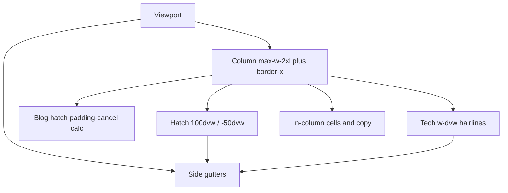

# UI / UX Design System

Personal portfolio for Pratik Nath Tiwari. Visual and interaction design source of truth. When code and this document disagree, prefer the code and update this file.

**Primary sources:** `src/app/global.css`, `src/app/(marketing)/layout.tsx`, `src/components/theme-switch.css`, marketing views, UI under `src/components/`.

**Out of scope:** product APIs, data architecture, unused database schemas. Those are not UI.

---

## 1. Overview

### Product surface

Narrow-column personal site: intro, tech stack, work history, projects, GitHub and listening activity, blog, about, legal, plus contact and resume from the footer.

### Design intent

| Principle | What it means in the UI |
| --- | --- |
| Engineer-dense, not marketing-loud | One reading column, muted type, hatch section bars, no hero collage or stat strip |
| Dark-first | Default theme is dark when preference is unset (blocking script and theme switch) |
| Token-driven | Semantic HSL CSS variables for light and dark; brand accent is teal |
| Pattern language, not flat voids | Diagonal hatch bars, blog dot grid, tech cell grid, contribution week grid. The home page canvas itself is flat (`bg-background`); patterns are applied to specific chrome, not the whole viewport |
| Sharp editorial chrome | Many surfaces use `rounded-none` even though the global radius token is soft |
| Motion with purpose | Stagger, graph pop-in, feed rotation; respect `prefers-reduced-motion` |
| Degrade gracefully | Skeletons and empty states when APIs fail |

### How to read this document

Sections 2 through 7 are foundations: routes, shell, color, type, spacing, patterns. Sections 8 and 9 are the layout engine: full-bleed math and cell-based UI. The rest is per-page anatomy, motion, components, and constraints.

---

## 2. Information architecture and routes

`(marketing)` is a route group. It does not appear in the URL.

```
RootLayout                         src/app/layout.tsx
└─ MarketingLayout                 src/app/(marketing)/layout.tsx
   ├─ /                            HomeView
   ├─ /about                       AboutView
   ├─ /experience                  ExperienceView
   ├─ /after-hours                 AfterHoursView
   ├─ /privacy                     PrivacyView
   ├─ /terms                       TermsView
   ├─ BlogLayout                   src/app/(marketing)/blog/layout.tsx
   │    /blog                      BlogView → BlogArchive
   │    /blog/[...slug]            BlogPostView
   │    /blog/topics               TopicsView
   │    /blog/topics/[topic]       inline topic archive page
   └─ DevLayout                    gated; notFound when locked
        /dev/spotify               SpotifyDevView

404                                src/app/not-found.tsx  (RootLayout only)
```

| Path | Layouts | Renders |
| --- | --- | --- |
| `/` | Root → Marketing | `src/views/marketing/home.tsx` |
| `/about` | Root → Marketing | `src/views/marketing/about.tsx` |
| `/experience` | Root → Marketing | `src/views/marketing/experience.tsx` |
| `/after-hours` | Root → Marketing | `src/views/marketing/after-hours.tsx` |
| `/privacy` | Root → Marketing | `src/views/marketing/privacy.tsx` |
| `/terms` | Root → Marketing | `src/views/marketing/terms.tsx` |
| `/blog` | Root → Marketing → Blog | `src/views/marketing/blog/index.tsx` |
| `/blog/[...slug]` | Root → Marketing → Blog | `src/views/marketing/blog/post.tsx` |
| `/blog/topics` | Root → Marketing → Blog | `src/views/marketing/blog/topics.tsx` |
| `/blog/topics/[topic]` | Root → Marketing → Blog | `src/app/(marketing)/blog/topics/[topic]/page.tsx` |
| `/dev/spotify` | Root → Marketing → Dev | `src/views/marketing/dev/spotify.tsx` |
| unmatched | Root only | `src/app/not-found.tsx` |

Blog layout wraps children in a nested `<main class="blog-layout">`. That is intentional. Hatch bleed under blog is calculated against this nested padding, not the viewport.

Non-page routes (`/rss`, `/og`, `/api/*`) are not UI surfaces.

Home hatch titles that link out:

| Home section | `titleHref` |
| --- | --- |
| Professional Experience | `/experience` |
| After Hours | `/after-hours` |
| Posts | `/blog` |

Home keeps teasers (accordion, dense project rows, post list). Dedicated routes are the full reading surfaces.

---

## 3. Page shell and layout geometry

### 3.1 Marketing shell

Source: `src/app/(marketing)/layout.tsx`.

```
┌─ viewport ─────────────────────────────────────────────────┐
│  large side gutters (empty canvas)                         │
│     ┌─ max-w-2xl + border-x ────────────────────────────┐  │
│     │ skip target #main-content                         │  │
│     │ breadcrumbs (hidden on /)                         │  │
│     │ page content                                      │  │
│     └───────────────────────────────────────────────────┘  │
│     ┌─ footer same width + border-x ────────────────────┐  │
│     │ brand · email · commit · contact · resume · legal │  │
│     └───────────────────────────────────────────────────┘  │
│  theme switch: fixed top-right (desktop) / bottom-right    │
└────────────────────────────────────────────────────────────┘
```

| Piece | Classes | Computed |
| --- | --- | --- |
| Outer shell | `min-h-screen w-full flex flex-col overflow-x-clip` | Clips `100dvw` hatch overflow |
| Skip link | `sr-only`, focused `absolute left-4 top-4 z-50` | 16px from top-left when focused; target `#main-content` |
| Main | `py-6 max-w-2xl mx-auto w-full grow border-x border-border/50` | **42rem / 672px** max width; **24px** vertical pad; 1px rails at 50% border. **No horizontal padding on `<main>`** |
| Breadcrumbs wrap | `px-4 md:px-5 pb-4` | 16px / 20px; `Breadcrumbs` returns nothing on `/` |
| Footer inner | `py-8 md:py-12 max-w-2xl mx-auto w-full border-x border-border/50 px-4 md:px-5` | Same column and rails; 32px / 48px vertical |
| Root `html` / `body` | background and type only | No page padding |

Content pads itself. Standard in-column pad is `px-4 md:px-5` (16px / 20px). Tailwind v4 `--spacing` is `0.25rem` (4px), so `px-N` = `N × 4px`.

### 3.2 Chrome that sits outside the column

| Layer | Placement |
| --- | --- |
| Theme switch | `position: fixed; top: 20px; right: 20px; z-index: 9999`. At `max-width: 640px`: `top: auto; bottom: 20px; right: 16px`. Idle-loaded via `AppChrome`. |
| Blog TOC | Mobile: in-flow, `2xl:hidden`. Desktop sidebar: `hidden 2xl:block absolute left-full top-32 ml-16 w-64`. Only UI that uses `2xl`. |

### 3.3 Nested blog padding

`src/app/(marketing)/blog/layout.tsx`:

```
<main className="blog-layout px-3 sm:px-4 md:px-6 lg:px-8 py-3 sm:py-4 md:py-6">
```

| Breakpoint | Horizontal | Vertical | Computed H |
| --- | --- | --- | --- |
| default | `px-3` | `py-3` | 12px |
| `sm` ≥640 | `px-4` | `py-4` | 16px |
| `md` ≥768 | `px-6` | `py-6` | 24px |
| `lg` ≥1024 | `px-8` | still `py-6` | 32px |

Blog pages sit inside marketing `max-w-2xl`, then add this second pad. Hatch bars under `.blog-layout` cancel only this inner pad (section 8).

### 3.4 Inner padding map

| Surface | Horizontal pad | Notes |
| --- | --- | --- |
| Breadcrumbs, footer, hero, most blurbs | `px-4 md:px-5` | 16 / 20px. Canonical content pad |
| Hatch title inner | `.header-content-container--with-padding` | `4×spacing` / `sm: 5×spacing` = 16 / 20px, matches content |
| Tech grid, contribution graph | none | Flush to column rails |
| Home work experience | `px-4` only | No `md:px-5` |
| About section bodies | `px-4 pt-4 pb-6` | Often no `md:px-5` |
| Home post rows | parent `px-4 md:px-5`; rows `-mx-4 md:-mx-5` | Hover wash bleeds to rails |
| Project rows | `px-4 sm:px-5` | 16 / 20px from `sm`, not `md` |
| Activity feed | `px-4 md:px-5` (list), `md:px-6` on one inner block | |
| 404 | `max-w-lg`, centered, no marketing rails | Outside the column system |

---

> **Note: large horizontal padding**
>
> The site’s large horizontal padding is the **outer gutter**, not the 16/20px in-column pad.
>
> The reading column is `max-w-2xl` (42rem / 672px) centered with `mx-auto`. On a wide viewport each side is empty canvas:
>
> `gutter = (viewportWidth - 672px) / 2`
>
> Example: at 1440px, each gutter is **384px**. At 1024px, **176px**. Below 672px the column is full width and the gutter is 0.
>
> This is intentional.
>
> - Do not widen the column to fill the viewport.
> - Do not put a second content rail, hero collage, card grid, or marketing strip in the gutters.
> - Hatch bars and tech edge-lines may **draw** into the gutters. Body copy and cells stay inside the column.
> - The shell uses `overflow-x-clip` so those breakouts do not create horizontal scroll.
>
> In-column padding stays modest (`px-4` / `md:px-5`). If a layout feels “too padded,” check whether you are looking at the gutter or the content pad before changing either.

---

## 4. Color system

Defined in `src/app/global.css` (`:root` / `.dark`), mapped into Tailwind via `@theme` as `--color-*`. Channels are HSL unless noted. Use `hsl(var(--token))` in CSS.

### Semantic tokens

| Token | Light | Dark | Role |
| --- | --- | --- | --- |
| `--background` | `0 0% 100%` | `0 0% 7%` | Page canvas |
| `--background-secondary` | `0 0% 96%` | `0 0% 8.6%` | Subtle alternate surface |
| `--foreground` | `0 0% 20%` | `0 0% 85%` | Primary text |
| `--muted` | `220 14% 96%` | `0 0% 18%` | Quiet fills |
| `--muted-foreground` | `0 0% 40%` | `0 0% 63%` | Secondary / helper text |
| `--primary` | `222 47% 11%` | `0 0% 90%` | Strong UI (buttons, emphasis) |
| `--primary-20` | same + `/ 0.2` | same + `/ 0.2` | Soft primary wash |
| `--primary-foreground` | `0 0% 98%` | `0 0% 7%` | Text on primary |
| `--secondary` / `--accent` | `220 14% 96%` | `0 0% 18%` | Soft fills / hover washes |
| `--secondary-foreground` / `--accent-foreground` | `222 47% 11%` | `0 0% 90%` | Text on those fills |
| `--border` / `--input` | `220 13% 91%` | `0 0% 18%` | Dividers, rails, inputs |
| `--ring` | `222 47% 11%` | `0 0% 90%` | Focus rings |
| `--card` / `--popover` | match background / foreground | same | Panels |
| `--destructive` | `355.47deg 98.62% 75.48% / 70%` | same | Errors / danger (soft alpha) |
| `--destructive-foreground` | same hue `/ 20%` | same | |

Sidebar tokens mirror the main set (reserved for admin-like chrome; no marketing sidebar ships).

Quirk: `@theme` maps `--color-input: var(--input)` **without** `hsl()`, unlike the other `--color-*` tokens.

### Brand accent

Constant across themes.

| Token | Value | Feel |
| --- | --- | --- |
| `--brand-400` | `167.8 53.25% 65%` | Soft teal |
| `--brand-500` | `167.8 53.25% 54.71%` | Stronger teal |

Used for contribution intensity, hue overlays, demo triggers, graph focus rings. Not a general brand wash on every page.

### Contribution level → color

Levels are derived from **GitHub commit count only** (Spotify tracks do not change the cell color).

| Level | Commits | Class |
| --- | --- | --- |
| 0 | 0 | `bg-neutral-200 dark:bg-neutral-900/70` |
| 1 | 1–3 | `bg-brand-500/30` |
| 2 | 4–6 | `bg-brand-500/50` |
| 3 | 7–9 | `bg-brand-500/75` |
| 4 | 10+ | `bg-brand-500` |

Empty stubs (before range start / after today) are `bg-transparent` and non-interactive. Focused cells: `ring-2 ring-brand-500 ring-offset-1 ring-offset-background`. There is no separate “today” ring.

After-hours weekly spark uses the same teal steps against a 12-week window, scaled by relative height, not GitHub levels.

### Syntax highlighting (`--sh-*`)

| Token | Light | Dark |
| --- | --- | --- |
| `--sh-background` | `220 14% 94%` | `0 0% 9%` |
| `--sh-border` | `220 13% 85%` | `0 0% 18%` |
| `--sh-text` | `222 47% 11%` | `0 0% 93%` |
| `--sh-comment` | `215 16% 47%` | `0 0% 55%` |
| `--sh-keyword` | `335 78% 42%` | `355 80% 75%` |
| `--sh-string` | `110 50% 30%` | `180 60% 75%` |
| `--sh-function` | `250 50% 40%` | `270 70% 75%` |
| `--sh-number` | `25 80% 40%` | `40 80% 70%` |
| `--sh-tag` | `210 50% 40%` | `120 70% 75%` |
| `--sh-operator` / `--sh-punctuation` | `220 14% 40%` | `0 0% 70%` |

### Theme switch (local hex, not semantic)

Day `#3d7eae` → `#5490c0`, night `#1d1f2c`, sun `#ecca2f`, moon `#c4c9d1`, clouds `#f3fdff` / `#aacadf`, spots `#959db1`. Confined to the toggle.

### Scrollbars

Global CSS **hides** scrollbars (`::-webkit-scrollbar { display: none }`, `scrollbar-width: none` on `*`). Do not assume a visible dark 8px scrollbar.

### Color usage rules

1. Prefer semantic tokens over raw hex.
2. Hierarchy via opacity (`border-border/50`, `text-muted-foreground/80`).
3. Brand teal for activity and selective accents only.
4. Destructive stays soft (alpha).
5. New hex outside tokens belongs in this document if it ships.

---

## 5. Typography

### Font loading vs tokens

| Layer | Reality |
| --- | --- |
| Root `<html>` | Geist Sans + Geist Mono CSS variables (`GeistSans.variable`, `GeistMono.variable`) plus `font-sans` |
| Tailwind `--font-sans` | `"Ubuntu Sans", system-ui, -apple-system, sans-serif` in `@theme`. Ubuntu Sans is **not** loaded |
| Practical outcome | `font-sans` falls through to system UI. Geist variables exist but are not wired into `--font-sans` |
| Mono voice | Bios, ledgers, meta: `font-mono tracking-tight` |

### Scale and weight

| Role | Spec |
| --- | --- |
| Page title (`PageHeader`) | `text-xl sm:text-2xl md:text-3xl font-semibold tracking-tight` |
| Home name | `text-xl font-semibold tracking-tight` |
| About name | `text-2xl font-semibold tracking-tight` |
| Blog post H1 | `text-2xl sm:text-3xl font-semibold tracking-tight leading-snug` |
| Section titles (hatch) | `text-sm font-medium text-muted-foreground` |
| Body / bio | `text-sm` + muted; mono for engineer blurbs |
| Tech labels | `text-[10px] font-medium leading-4 text-muted-foreground` |
| Meta / chips / year rules | `text-xs` or `text-[10px] font-mono` |
| Footer brand | `text-lg font-semibold` + primary-colored `.` in `name.dev` |
| 404 numeral | `text-6xl md:text-8xl font-bold text-muted-foreground/20 tracking-tighter` |

### Prose (blog)

- `.prose { text-wrap: balance }`
- Overflow wrap on prose / UGC: `overflow-wrap: anywhere`
- Paragraphs `line-height: 1.75`, 1em margins
- `h3` 1.125rem / weight 500; `h4` 1rem / weight 500
- Blockquote: 2px left border, italic, muted
- Classes: `prose-quoteless prose-neutral dark:prose-invert max-w-3xl`
- Work / experience list bullets use mono `+` markers via `before:content-['+']`

---

## 6. Spacing, radius, elevation, icons

### Spacing rhythm

No separate spacing scale file. Tailwind spacing is the system (`--spacing` = 0.25rem).

| Pattern | Use |
| --- | --- |
| `px-4 md:px-5` | Standard in-column horizontal pad |
| `py-6` | Main top/bottom |
| `space-y-6` | Home / about major blocks |
| `space-y-4` | Section groups, activity stack |
| `pt-3` / `pt-4` / `pb-6` | Content under hatch headers |
| `gap-2` / `gap-3` / `gap-4` | Chips, socials, grids |
| Footer | `py-8 md:py-12` |
| Outer gutters | See the large-padding note in section 3. Not a Tailwind token |

### Radius

| Token / class | Value / use |
| --- | --- |
| `--radius` | `0.375rem` |
| `--radius-lg` | `var(--radius)` |
| `--radius-md` | `calc(var(--radius) - 2px)` |
| `--radius-sm` | `calc(var(--radius) - 4px)` |
| Buttons / inputs | `rounded-md` |
| Contribution cells | `rounded-[2px]` |
| Avatars | `rounded-full` + `border-2 border-border/50` |
| Editorial / tooling | Prefer `rounded-none` (subsections, about social chips, many borders, 404 CTAs) |
| Resume drawer | `rounded-t-[10px]` (Vaul sheet exception) |

### Elevation / shadow

| Surface | Treatment |
| --- | --- |
| Default page | Flat. Depth from borders and hatch, not cards |
| Avatar | `shadow-sm` |
| Activity hover card | `shadow-xl` + `backdrop-blur-md` + `bg-background/95` (typical) |
| Contact / popovers | Border + shadow panels |
| Theme switch | Custom inset/outset box-shadows (skeuomorphic toggle) |
| Admin glass (reserved) | `backdrop-filter: blur(12px)` + translucent card |
| Resume overlay | `bg-black/40 backdrop-blur-sm` |

### Iconography

| Library | Use |
| --- | --- |
| `lucide-react` | UI chrome (briefcase, mail, git, chevrons, plus nodes, socials) |
| `react-icons/si` | Brand logos in tech stack and language icons |

Common sizes: `size-3` / `size-3.5` / `size-4` in text rows; tech icons `h-8 w-8 md:h-10 md:w-10` at `text-foreground/60` → hover full foreground. Plus decorators: `size-6`, `strokeWidth={1}`, `text-muted-foreground/50`.

### Borders

- Rails and section dividers: usually `border-border/50` or `/40` / `/60`
- Hairlines: 1px
- Focus: `ring-2 ring-ring` (or `ring-brand-500` on graph cells)

### Z-index (observed)

| Layer | Value |
| --- | --- |
| Skip link (focused) | `z-50` |
| Theme switch | `9999` |
| Resume overlay / drawer | `z-50` |
| Hatch content vs hue overlay | content `z-1`, overlay `z-0` |
| Admin sticky sidebar (reserved) | `z-20` |
| Work-experience fade / toggle | `z-30` / `z-40` |
| Hover cards | portal, high stacking |

---

## 7. Pattern system

There is **no full-bleed background grid on the marketing shell**. Body and main use solid `bg-background`. Patterning is local.

### 7.1 Dot grid (`.bg-pattern`)

Used on **blog post** surfaces (`src/views/marketing/blog/post.tsx`).

| Property | Value |
| --- | --- |
| Base fill | `hsl(var(--background))` |
| Dots | `radial-gradient(hsl(var(--foreground) / 0.07) 1px, transparent 1px)` |
| Pitch | `background-size: 16px 16px` |
| Feel | Subtle editorial paper; readable under prose |

OG images use a separate radial-dot recipe (40px pitch). Do not treat that as the CSS `.bg-pattern`.

### 7.2 Diagonal hatch

Same recipe in three places:

```
repeating-linear-gradient(
  -45deg,
  transparent,
  transparent 2px,
  hsl(var(--foreground) / α) 2px,
  hsl(var(--foreground) / α) 3px
)
```

| Surface | Alpha | Role |
| --- | --- | --- |
| `.full-width-header` | `0.03` | Full-bleed section title bars (44px / 48px `sm+`) |
| `.screen-border::before` | `0.05` | 12px band behind a 1px hairline (blog meta → body) |
| Skill / hatch chips | `0.05` | Inline pills (`border-foreground/10`) |

Optional motion: `.animate-pattern-flow` drifts `background-position` over **60s**. End position `-42.4264px -42.4264px` (√2 × 30, one diagonal step of a 30px period).

Optional tint: `.hue-overlay::before` lays a brand/primary horizontal shimmer (`tech-shimmer`, 8s) over the hatch. Content stays `z-index: 1`.

`Heading` can also layer Tailwind gradients (`bg-gradient-to-br` + `from/via/to-background/*`) via `bgDirection` / `colorPattern`. Activity uses `diagonal` + `dark`.

### 7.3 What is not a page background

- Home, about, projects list, activity: flat background + borders/hatch only on chrome.
- Scrollbars are hidden, not patterned.
- Theme switch night sky is self-contained inside the toggle.

---

## 8. Full-bleed and breakout math

The column is 672px. Several chrome pieces must *look* viewport-wide (or rail-wide) without taking copy out of the column.



### 8.1 Hatch bars (`.full-width-header`)

Used by `Section` and `Heading`.

Default (non-blog):

```
position: relative
width: 100dvw
left: 50%
right: 50%
margin-left: -50dvw
margin-right: -50dvw
height: 44px          /* 48px from sm */
margin-bottom: 1.25rem /* 1.5rem from sm */
border-top/bottom: 1px solid hsl(var(--border))
```

**Formula:** the bar lives inside `max-w-2xl`. `left: 50%` moves its left edge to the column center. `margin-left: -50dvw` pulls that edge to the viewport left. `width: 100dvw` spans the viewport. `margin-right: -50dvw` balances the right.

Title text is re-constrained:

```
.header-content-container {
  width: 100%;
  max-width: 42rem;   /* same as max-w-2xl */
  margin: 0 auto;
}
```

`--with-padding` forces 16px / 20px (`sm+`) so titles align with `px-4 md:px-5` copy.

`Section` default `SECTION_PADDING` is `px-0`. Views pad their own bodies. Flags: `noHeaderMargin` (`!mb-0`), `animatedStripes` (`.animate-pattern-flow`), `titleHref` (title text is the link, not the whole bar).

`Heading` adds optional gradient, `hue-overlay`, and extra `max-w-screen-xl mx-auto px-4` on the inner container (redundant with the header container; Activity is the main consumer).

### 8.2 Blog exception (padding-cancel, not viewport)

Under `.blog-layout`, the `100dvw` path is cancelled (`left/right: auto`). The bar only expands by the nested blog padding:

| Breakpoint | Blog `px-*` | Width | Side margins |
| --- | --- | --- | --- |
| default | 12px (`px-3`) | `100% + 6×spacing` | `±3×spacing` |
| ≥640px | 16px | `100% + 8×spacing` | `±4×spacing` |
| ≥768px | 24px | `100% + 12×spacing` | `±6×spacing` |
| ≥1024px | 32px | `100% + 16×spacing` | `±8×spacing` |

`--spacing` = 0.25rem, so `N×spacing` in rem is `N × 0.25`. Width uses `2 × pad` because both sides are cancelled.

Hatch under blog stops at the **column rails**, not the viewport. Nested inside `max-w-2xl`, that is the correct visual: a bar that meets the 1px side borders.

### 8.3 Tech stack edge lines (draw, do not break out)

The tech grid stays column-width. Viewport hairlines are absolutely positioned:

```
absolute left-1/2 -translate-x-1/2 w-dvw border-t   /* top, -top-px */
absolute left-1/2 -translate-x-1/2 w-dvw border-b   /* bottom, -bottom-px */
```

`pointer-events-none`. Content never leaves the column. Only the 1px rules paint across the gutters.

### 8.4 Screen border (blog post divider)

`.screen-border`: 1px `height`, `background: hsl(var(--border))`, `margin: 2rem 0`. `::before` is a 12px-tall hatch band (`α = 0.05`) centered on the line, `z-index: -1`.

---

## 9. Cell-based layout systems

The site treats the column like a ledger: bordered units, shared hairlines, no card stack. Two true cell grids (tech, contributions) plus ledger row grids (archive, roster, catalog, project rows).

### 9.1 Shared rules

- Cells live **inside** the column. Breakouts are chrome only (section 8).
- Shared 1px borders; adjacent cells do not double-stroke. Typical recipe: `border-r` + `border-b`, drop the trailing edge on the last column / last row.
- Checker or hatch fill is optional, never a drop shadow per cell.
- Square cells size themselves with CSS (`1fr` + `aspect-square`, or equal grid tracks). JS does not measure cell pixels for layout.

### 9.2 Tech stack cells

Source: `src/components/landing/tech-stack-cloud.tsx`.

**Grid**

```
relative grid grid-cols-2 md:grid-cols-4
```

8 logos → **2×4** below `md`, **4×2** at `md+`. Grid is flush to the column (no `px-*` on the grid). Blurb above uses `px-4 md:px-5`.

**Per cell**

| Spec | Value |
| --- | --- |
| Min height | `min-h-[120px]` |
| Pad | `px-4 py-8 md:p-8` |
| Icon well | `h-10 w-10`; icons `h-8 w-8 md:h-10 md:w-10` |
| 3D | `perspective: 1000px` |
| Label | `text-[10px] font-medium leading-4 text-muted-foreground` |

**`CARD_STYLES` (index 0–7)**

Borders always include a bottom edge on mobile. At `md`, the last row drops `border-b`. Checker `bg-secondary` (with `dark:bg-secondary/30` on several cells) alternates so the wall reads as a tiled board, not eight cards.

| i | Mobile | `md` extras | Plus nodes |
| --- | --- | --- | --- |
| 0 | `border-r border-b` + secondary | same | bottom-right |
| 1 | `border-b` | `md:border-r` | none |
| 2 | `border-r border-b` | secondary on md | BR always; BL `hidden md:block` |
| 3 | `border-b` + secondary | md clears secondary | none |
| 4 | `border-r border-b` + secondary | `md:border-b-0`, bg reset | BR, `md:hidden` |
| 5 | `border-b` | `md:border-r md:border-b-0` + secondary | none |
| 6 | `border-r border-b` | `md:border-b-0` | none |
| 7 | `border-b` + secondary | `md:border-b-0` | none |

Fallback if a style is missing: `border-r border-b`.

**Plus math**

Lucide `Plus` is `size-6` (24px). Offset `-right/-left/-bottom-[12.5px]`. Half of 24 is 12; the extra 0.5px sits the icon on the 1px corner stroke. `z-10`, `strokeWidth={1}`, `aria-hidden`.

**3D flip (scroll, not layout)**

For cells with multiple icons:

```
if scrollY < 50: rotation = 0
else:
  start = 0.4, range = 0.2          // progress window 0.4 → 0.6
  p = clamp((scrollYProgress - start) / range, 0, 1)
  raw = p * (Icons.length - 1) * 180
  stepped = round(raw / 180) * 180  // snap to 180°
  rotationX = spring(stepped, stiffness: 222, damping: 45)
  iconIndex = floor((latest + 90) / 180) % Icons.length
```

Odd faces apply `rotateX(180deg)` + `backfaceVisibility: hidden`. Uses Framer `useScroll` on the card ref. No `getBoundingClientRect` for sizing.

### 9.3 Contribution graph

Source: `src/components/landing/activity/contribution-graph.tsx`.

**Range**

```
MOBILE_VIEWPORT_MQ = '(max-width: 767px)'   // Tailwind md threshold
MOBILE_MONTHS_BACK = 6
```

- Mobile: `now - 6 months`
- Desktop: `now - 1 year`
- Synced with `matchMedia` listeners so week count (and therefore cell size) changes with viewport, not a pixel measure of the grid

Why: a year of weeks in a ~390px column produces ~4px squares (unreadable). Six months keeps cells closer to 10px+ on phones. See the worked example below.

**Week math (Sunday start, GitHub-style)**

```
gridStart = startDate
gridStart.setDate(gridStart.getDate() - gridStart.getDay())  // back to Sunday

diffDays = floor((today - gridStart) / 86400000)
totalWeeks = floor(diffDays / 7) + 1
```

Each week is 7 days (`j < 7`). Walking date starts at `gridStart`. If `date < startKey` or `date > todayKey`, push an empty stub (`date: ''`, non-interactive, transparent). Otherwise look up the day map or a zero-count placeholder.

Month labels: walk weeks from the same Sunday origin; emit a label when the month key changes and `currentDate >= startDate`. Last month label aligns `right-0`, others `left-0`. Label row height `h-[15px]`, `text-[10px]`.

**CSS grid**

```
gridTemplateColumns: 1fr repeat(${totalWeeks}, 1fr) 1fr
gap: 3px
```

Leading and trailing `1fr` gutters (empty `div`s, `pointer-events-none`). Week columns are `flex flex-col gap-[3px]`. Cells:

```
w-full aspect-square rounded-[2px] cell-pop-in
```

**Cell size (do not hardcode; this is the runtime formula)**

Let `W` = graph width (the marketing column, flush: `min(viewport, 672px)`).

```
columns = totalWeeks + 2
gaps    = (columns - 1) * 3px = (totalWeeks + 1) * 3
cell    = (W - gaps) / columns     // square; height = width
```

Worked examples:

| Viewport | W | Weeks (approx) | Columns | Gap px | Cell |
| --- | --- | --- | --- | --- | --- |
| 1440 desktop | 672 | 53 | 55 | 162 | ≈ 9.3px |
| 768 desktop | 672? / 768 column capped at 672 | 53 | 55 | 162 | ≈ 9.3px |
| 390 mobile, 6 months | 390 | ~26 | 28 | 81 | ≈ 11.0px |
| 390 mobile, if 1 year (not used) | 390 | 53 | 55 | 162 | ≈ 4.1px |

Legend swatches are fixed `10×10px`, `rounded-sm`, `gap` implicit in the flex row. They do not drive graph cell size.

**Pop-in**

```
@keyframes cell-pop-in {
  0%   { opacity: 0; transform: scale(0.92); }
  100% { opacity: 1; transform: scale(1); }
}
.cell-pop-in {
  animation: cell-pop-in 0.28s cubic-bezier(0.22, 1, 0.36, 1) both;
}
```

Reduced motion: animation off, `opacity: 1`.

**JS that measures the DOM**

| Use | Effect on layout? |
| --- | --- |
| `matchMedia` mobile / coarse pointer | Changes date range (week count), therefore cell size via CSS |
| `getBoundingClientRect` on hover | Tooltip only: `left: x`, `top: y - 12`, `translate(-50%, -100%)` |

Cell pixel size is never assigned in JS.

**Day dialog**

Click a cell with data → `role="dialog"` with commits and tracks. Escape restores focus to the trigger. Tooltips are desktop / fine-pointer only.

### 9.4 Ledger row grids

Same visual family: hairline rows, mono rails, hatch chips. Not equal squares.

**Blog archive** (`src/components/blog/blog-archive.tsx`)

| Piece | Layout |
| --- | --- |
| Meta + filter chips | `px-4 py-3 md:px-5`; active chip uses hatch fill |
| Year sticky bar | `sticky top-0`, `px-4 py-2 md:px-5` |
| Row | `grid-cols-[3.5rem_minmax(0,1fr)_auto]` → md `[4.5rem_…_auto]`; `gap-3` / `md:gap-4`; `px-4 py-4 md:px-5` |
| Rail | `3.5rem` / `4.5rem`: month abbreviation + day |
| Motion | `animate-stagger` per row |

Filter tabs: `role="tablist"`. Topics index stays at `/blog/topics`.

**Experience roster** (`src/components/experience/experience-roster.tsx`)

| Piece | Layout |
| --- | --- |
| Meta + jump nav | `px-4 py-3 md:px-5`; `N companies · now X · + education` |
| Dossier | `grid-cols-[3.25rem_minmax(0,1fr)]` → md `[4.5rem_…]`; `gap-3` / `md:gap-5`; `px-4 py-6 md:px-5` |
| Rail | mono year + company initial |
| Positions | `border-l pl-4`; always open; hatch skill chips |
| Motion | `animate-stagger`, delay `index * 80ms` |

Home Experience stays accordion (`WorkExperience`, `px-4`). This route is the open ledger.

**After-hours catalog** (`src/components/after-hours/after-hours-catalog.tsx`)

| Piece | Layout |
| --- | --- |
| Meta | `px-4 py-3 md:px-5`; `N projects · shipped · in progress` + GitHub handle |
| Entry | `border-b` stack, `px-4 py-6 md:px-5` (no cards) |
| Spark | last 12 weeks, `w-[3px]`, height `max(2, count/max * 12)` px |
| Motion | `animate-stagger`, delay `index * 70ms` |

**Project rows** (home After Hours teaser)

Sources: `project-row.tsx`, `project-showcase-client.tsx`.

| Spec | Value |
| --- | --- |
| Desktop MQ | `(min-width: 1024px)` hover expand |
| Below | tap + `aria-expanded` |
| Row chrome | `border-b`, header `px-4 sm:px-5 py-2` |
| Name max-width | md `40% → 55%` on hover; lg `32% → 45%` |
| Easing | `cubic-bezier(0.16, 1, 0.3, 1)` |

**Skill chips**

Hatch fill `α = 0.05`, same 2px/3px recipe, `text-xs`, `border-foreground/10`. About page skills are the exception: `bg-secondary/30`, `rounded-md`, no hatch.

**Blog prev/next**

`grid-cols-1 sm:grid-cols-2 gap-4` under the article.

### 9.5 Skeletons

Tech, contribution, activity, blog, work, and catalog skeletons match the live geometry (same grid tracks, plus offsets, `w-dvw` lines, `gap-[3px]` + `aspect-square`). Prefer updating the skeleton in the same change as the live cell layout.

---

## 10. Per-page anatomy

### 10.1 Home (`HomeView`)

Outer `space-y-6` around intro; inner group `space-y-4`.

| # | Section | Header chrome | Body |
| --- | --- | --- | --- |
| 1 | Intro | None | Row: 56px avatar + name/title; mono bio. `px-4 md:px-5` |
| 2 | Tech Stack | Hatch + `animate-pattern-flow`, `noHeaderMargin` | Mono blurb → 2×4 / 4×2 logo cells; viewport top/bottom rules; Plus nodes; scroll-linked 3D flip |
| 3 | Professional Experience | Hatch + stripes; title → `/experience` | Accordion timeline (`px-4`); current employer expanded; hatch skill chips; mono `+` bullets |
| 4 | After Hours | Hatch + stripes; title → `/after-hours` | Vertical project stack; desktop hover expands preview; mobile tap |
| 5 | Activity & Contributions | `Heading` hatch + diagonal dark wash + year | Mono blurb → contribution week grid + legend → rotating feed (`rotationInterval={4500}`, 8 items) |
| 6 | Posts | Hatch + post count; title → `/blog` | Description under `border-b` → teaser list (`line-clamp-2`), rows bleed hover to rails |

Clickable hatch titles use `Section` `titleHref`: title text only, muted → foreground hover, focus ring.

Dynamic sections load with matching skeletons.

### 10.2 Experience (`/experience`)

| Block | Layout |
| --- | --- |
| Intro | Hatch “Professional Experience” + mono ledger manifesto + reading note (`px-4 pt-4 pb-5 md:px-5`) |
| Roster | Hatch “Roster”; meta strip + initial jump nav + open dossiers |

### 10.3 After Hours (`/after-hours`)

| Block | Layout |
| --- | --- |
| Intro | Hatch “After Hours” + mono manifesto (not a `PageHeader`) |
| Catalog | Hatch “Catalog”; meta strip + full editorial entries |

### 10.4 Blog (`/blog`)

| Block | Layout |
| --- | --- |
| Intro | Hatch “Posts” + mono field-notes manifesto |
| Archive | Hatch “Archive”; topic hatch-chip filter + sticky year rules + logbook rows |

Home Posts stays the short teaser. This route is the full archive.

### 10.5 About (`/about`)

| Block | Layout |
| --- | --- |
| Header | 80px avatar, name `text-2xl`, title + location with icons, sharp `rounded-none` social chips. `px-4 md:px-5` |
| About Me / Education / Skills / Get In Touch | Each is a hatch `Section`; content `px-4 pt-4 pb-6` |
| Education | Icon well (`rounded-none bg-primary/10 border-primary/20`) + title/school/years |
| Skills | Flex-wrap chips (`bg-secondary/30`, soft hover border) |

### 10.6 Blog post / topics

| Surface | Layout |
| --- | --- |
| Post | TOC (in-flow until `2xl`, then right of column) → `.bg-pattern` section → meta client header → `.screen-border` hatch divider → `prose max-w-3xl` article → prev/next 2-col grid |
| Topics index | `PageHeader` “Topics” + `border-b` list rows with hash well |
| Topic archive | `PageHeader` + filtered post list |

### 10.7 Legal / 404 / Dev

| Page | Notes |
| --- | --- |
| Privacy / Terms | Sticky bilingual header; scroll-hide on small screens (`innerWidth < 768`) |
| 404 | Narrow `max-w-lg`, muted copy, sharp CTAs; **no** marketing rails or footer |
| `/dev/spotify` | Dev-only OAuth bootstrap; same column feel when the gate allows it |

### 10.8 Footer

Same column rails. Brand link, copy-email control (Sonner toast), relative last-commit with `AnimatedNumber`, Contact popover, Resume drawer, socials, legal links. Stacks vertically on small screens; row on `md+`.

---

## 11. Motion and animation

### Easing vocabulary

| Name | Curve | Typical use |
| --- | --- | --- |
| Expo-out (primary) | `cubic-bezier(0.16, 1, 0.3, 1)` | Stagger, cards, codeblock, project rows, demo popover |
| Soft pop | `cubic-bezier(0.22, 1, 0.36, 1)` | `cell-pop-in` |
| Theme overshoot | `cubic-bezier(0, -0.02, 0.4, 1.25)` | Theme switch container |
| Theme circle | `cubic-bezier(0, -0.02, 0.35, 1.17)` | Sun/moon travel |
| Accordion | `cubic-bezier(0.25, 0.46, 0.45, 0.94)` | `.accordion-smooth` |
| Exit | `cubic-bezier(0.4, 0, 1, 1)` | `codeblock-exit` |
| Search toggle (declared) | `cubic-bezier(0.2, 0.9, 0.3, 1)` | `.codeblock-search-toggle` (keyframes missing) |

### CSS keyframes

| Animation | Behavior |
| --- | --- |
| `enter` / `exit` | Fade + 8px rise / 4px lift |
| `stagger-in` | Fade + rise 12px, 0.4s, expo-out |
| `cell-pop-in` | Scale 0.92 → 1, 0.28s |
| `music-bar` | Listening equalizer |
| `pattern-flow` | Hatch drift, 60s, `-42.4264px` |
| `tech-shimmer` | Sweep (2s on `.tech-shimmer-effect`, 8s on hue overlay) |
| `proficiency-fill` | Bar width grow |
| `project-card-hover` | Lift -4px + scale 1.02 |
| `demo-border-march` | Dashed brand border |
| `demo-popover-enter` | 0.2s expo-out |
| `wiggle` | ±12deg |
| Codeblock suite | enter, exit, collapse/expand, copy, toast, chevron |
| Theme switch | `shootingStar`, `meteor`, `twinkle`, `cometMove`, `auroraWave` |

`.stagger-1` … `.stagger-8`: 50ms delay steps (50ms through 400ms).

`.animate-stagger` uses `stagger-in`. Catalog uses 70ms index steps; roster uses 80ms.

### Motion (JS)

| System | Behavior |
| --- | --- |
| `StaggerProvider` | App config: `baseDelay: 80`, `initialDelay: 0`, `strategy: "mount-order"`. Default in the module is `position` / `rowThreshold: 50` if unconfigured. In-view gate (`useInView` once, margin `-50px`); reduced motion ready immediately |
| `AnimatedNumber` | Digit reel; static if reduced motion |
| Contribution cells | CSS pop-in; day dialog |
| Activity feed | 4500ms rotation; pause on interact; music bars when playing |
| Tech cloud | Scroll spring flip `stiffness: 222`, `damping: 45` |
| Project rows | Hover/tap expand; name width transition |
| Theme switch | Decorative night sky (desktop extras hidden ≤640px) |
| Contact / Resume | Dialog / Vaul (`85dvh`, fullscreen `100dvh` on `md+` toggle) |

### Reduced motion

- Early block: `.cell-pop-in` → no animation, `opacity: 1`
- Large block in `global.css`: kills decorative animations/transitions (stagger, pattern-flow, shimmer, demo, project-card, scrolled-away, codeblock pieces)
- Theme switch CSS: animations off; decorative night sky hidden
- `AnimatedNumber` and stagger hooks honor `useReducedMotion`

**Quirk:** Callout base styles (`.callout`, `.callout-indicator`, `.callout-body`, dark variant) are nested inside `@media (prefers-reduced-motion: reduce)`. Callouts from `remark-callout-directives` may be unstyled for users who do not request reduced motion.

---

## 12. Component inventory

| Component | Variants / notes |
| --- | --- |
| `Button` | `default` `outline` `secondary` `ghost` `link`; sizes `default` `sm` `lg` `icon`; Radix `Slot` via `asChild`; `rounded-md`, focus `ring-2 ring-ring` |
| `Section` | Optional hatch title, `animatedStripes`, `titleHref`, padding flags, `noHeaderMargin` |
| `Heading` | Hatch + gradient direction/pattern + hue + stripes + action |
| `SubSection` | Sharp bordered mini-panel |
| `TimelineItem` | Rail + icon well |
| `PageHeader` | Responsive `h1` + subtitle/description |
| `Skeleton` | `animate-pulse rounded-md bg-muted`; section skeletons match live geometry |
| `CodeBlock` | Prism, lines, copy, sharp chrome |
| `ThemeSwitch` | Fixed toggle; idle-loaded |
| `StaggerProvider` / `useStaggerLayer` | Mount-order 80ms in app |
| `AnimatedNumber` | Digit reel + `sr-only` full value |
| `CurrentYear` | `<time>` |
| Contact popover | Focus trap, honeypot form, email autocomplete |
| Resume drawer | PDF iframe, download, fullscreen `md+` |
| Hover cards | Portal; default delay 150ms (`hover-wrappers` passes 200); off on touch or width &lt; 768 |

No full Radix Dialog/HoverCard package. Button uses `@radix-ui/react-slot` only.

---

## 13. Feature UX patterns

| Feature | Interaction |
| --- | --- |
| Contribution graph | Click cell → day dialog (commits + tracks); Escape restores focus; tooltips desktop-only |
| Activity feed | Auto-rotate 4.5s; swipe / pause; music bars when playing |
| Tech stack | Hover brightens icons; scroll flips multi-icon cells |
| Projects (home) | Desktop ≥1024px = hover expand; below = tap; lazy preview |
| Work experience (home) | Current open; history/education toggles; fade + expand control |
| Blog archive | Tag filter tabs; sticky year rules |
| Blog links | External arrow nudges on hover |
| Footer email | Copy + Sonner toast |
| Legal | Language toggle; header hides on downward scroll only below 768px |
| Resume | Vaul sheet 85dvh; `md+` can go `100dvh` |

---

## 14. Theme behavior

| Layer | File | When `theme` is unset |
| --- | --- | --- |
| Blocking `<head>` script | `src/app/layout.tsx` | `dark` if `t === 'dark' \|\| !t` (always dark) |
| `ThemeSwitch` | `theme-switch.tsx` | `savedTheme === 'dark' \|\| !savedTheme` → dark |
| `ThemeInitializer` | `theme-initializer.tsx` | Dark if saved dark **or** (no save **and** `prefers-color-scheme: dark`) |

Persist keys: `dark` / `light` in `localStorage`.

The initializer can flip to light after paint when the OS is light and nothing is stored, fighting the blocking script and the switch. Documented here as a conflict; do not invent a product decision in CSS.

Root `<html>` uses `suppressHydrationWarning` because of the class toggle.

---

## 15. Responsive breakpoints

Tailwind prefixes actually used in product UI:

| Breakpoint | Width | Role |
| --- | --- | --- |
| `sm` | ≥640px | Hatch height 48px, type steps, blog pad, project row pad, theme switch still top-right until 640 **max** |
| `md` | ≥768px | Dominant: `px-4 md:px-5`, tech 4-col, footer row, legal header, resume fullscreen control, contribution 1-year range |
| `lg` | ≥1024px | Blog nested pad `px-8`; project showcase treats this as desktop hover |
| `xl` | ≥1280px | Unused in `src` |
| `2xl` | ≥1536px | Blog TOC sidebar only |

Raw CSS media: `640` / `768` / `1024` in `global.css`; theme switch `@media (max-width: 640px)`; contribution `max-width: 767px`; showcase `min-width: 1024px`.

---

## 16. Accessibility

- Skip link → `#main-content`; main is `tabIndex={-1}`
- Focus rings on interactive chrome; breadcrumb `aria-current="page"` and `aria-label`
- Dialogs: `role="dialog"`, Escape, trap/restore (contact, contribution day)
- Labels on theme (`aria-label="Toggle dark mode"`), socials, graph cells, mobile project rows (`aria-expanded`, `aria-controls` where used)
- Blog archive: `role="tablist"` for tags
- Email autocomplete: combobox / listbox / activedescendant
- Activity: region + `sr-only` graph title, live region / progress where loading
- Reduced-motion paths
- `AnimatedNumber` `sr-only` full value + `aria-hidden` visuals
- Skeletons: `aria-busy` / accessible labels
- Meaningful image `alt`s (avatar includes name + title)

---

## 17. Performance-related UX

- Home tech / work / activity are `next/dynamic` with matching skeletons
- App chrome (theme switch + Sonner) idle-loaded: `requestIdleCallback` timeout 2500ms, fallback 1500ms
- CSS `contain` on `.blog-card`, `.activity-section`, `.tech-grid`, `.projects-grid`, `.codeblock-content`
- Activity deferred via data hooks + skeleton; React Query keep-previous-data on refresh where configured
- Contribution tooltip and hover cards skipped on coarse pointers

---

## 18. Do / don’t

**Do**

- Keep the narrow column and the large outer gutters (section 3 note)
- Use `.bg-pattern` for long-form reading surfaces; hatch for section chrome
- Accent with brand teal sparingly
- Prefer sharp edges for tooling chrome
- Size new cell grids with CSS tracks + gaps; document the formula here if it is non-obvious
- Gate decorative motion behind reduced-motion checks
- Update matching skeletons in the same change as cell layout

**Don’t**

- Paint a full-page grid on home unless you deliberately change the system
- Fill the side gutters with a second layout
- Widen `max-w-2xl` to “use the space”
- Introduce purple marketing gradients on product UI (OG still has a legacy indigo bar; treat as debt)
- Add hero cards / stat strips to the first viewport
- Hover-only essential actions on mobile
- New hex colors outside tokens without documenting them
- Measure cell pixels in JS for layout

---

## 19. Key files

| Concern | Path |
| --- | --- |
| Tokens, patterns, keyframes, prose, hatch math | `src/app/global.css` |
| Theme toggle | `src/components/theme-switch.tsx`, `theme-switch.css` |
| Theme default | `src/app/layout.tsx` (blocking script), `theme-initializer.tsx` |
| Shell / fonts | `src/app/layout.tsx`, `src/app/(marketing)/layout.tsx` |
| Blog nested pad | `src/app/(marketing)/blog/layout.tsx` |
| Home stack | `src/views/marketing/home.tsx` |
| Section / heading chrome | `src/components/ui/section.tsx`, `heading.tsx` |
| Tech grid | `src/components/landing/tech-stack-cloud.tsx` |
| Contribution graph | `src/components/landing/activity/contribution-graph.tsx` |
| Activity section / feed | `src/components/landing/activity/section.tsx`, `activity-feed.tsx` |
| Projects | `src/components/projects/` |
| Blog archive / post | `src/components/blog/blog-archive.tsx`, `src/views/marketing/blog/post.tsx` |
| Experience roster | `src/components/experience/experience-roster.tsx` |
| After-hours catalog | `src/components/after-hours/after-hours-catalog.tsx` |
| Footer / breadcrumbs | `src/components/layout/footer.tsx`, `breadcrumbs.tsx` |

---

## 20. Known visual quirks

These affect what ships. Fix in code, then strike them from this list.

1. **Font:** Geist is loaded; `--font-sans` is Ubuntu Sans (unloaded) → system fallback.
2. **Theme default:** Script + switch = dark-first; initializer follows system when unset.
3. **Callout CSS:** Full `.callout*` rules live only inside `prefers-reduced-motion: reduce`.
4. **Scrollbars:** Hidden globally.
5. **Missing keyframes:** `.codeblock-search-toggle` references `@keyframes codeblock-search-toggle`, which is not defined.
6. **`--color-input`:** No `hsl()` wrapper in `@theme`.
7. **bcv2 hover:** Light rgba rules appear after dark rules and override both.
8. **`.scrolled-away`:** Two `transform` declarations; the second wins (`translateY(-35px)` only).
9. **Header container:** `.header-content-container` padding is reset to 0 at `md` twice (duplicate media blocks). `--with-padding` still wins for section titles.
10. **In-column pad drift:** Some blocks are `px-4` only (work experience, about bodies) while the canonical pad is `px-4 md:px-5`.

---

## 21. Future visual work

1. Wire Geist (or load Ubuntu Sans) into `--font-sans`.
2. Align theme default across script / initializer / switch.
3. Move callout CSS out of the reduced-motion block.
4. Decide whether scrollbars should be visible and theme-aware.
5. Reconcile OG indigo accent with brand teal.
6. Define `@keyframes codeblock-search-toggle` or remove the class.
7. Update this document in the same PR as visual changes.

---

## Notes

- Home canvas is **flat**. Dot grid and hatch are localized patterns, not a sitewide wallpaper.
- Unused DB schemas are not UI. Do not invent surfaces that are not shipped.
- Large side gutters are intentional. See the note in section 3.
